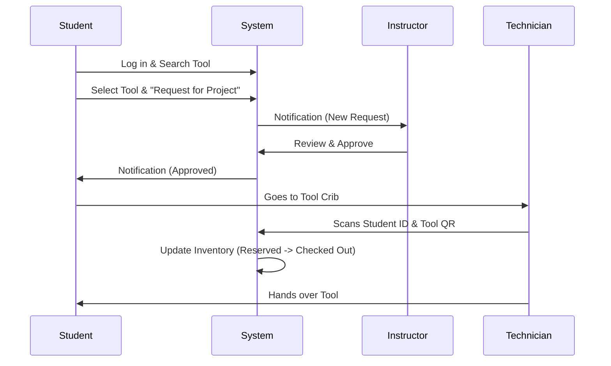
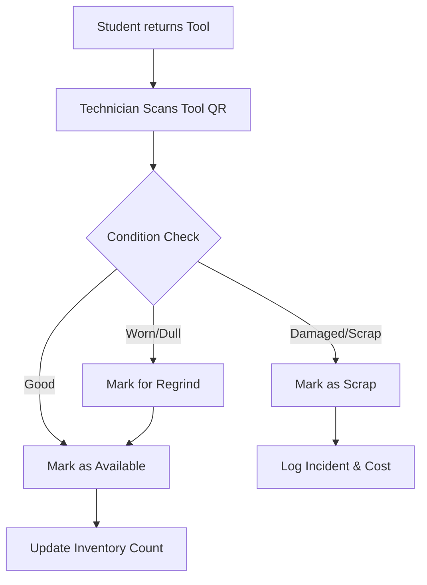

# CNC Tools & Inserts Inventory Management System - Design Specification

**Version:** 1.0
**Author:** Senior Manufacturing Systems Engineer (Jules)
**Date:** 2024-05-22
**Target Audience:** University Management, IT Staff, Lab Managers, Students

---

## 1. Executive Summary

This document outlines the design for a comprehensive CNC Tools & Inserts Inventory Management System tailored for a public university CNC laboratory. The system is designed to balance industrial rigor with educational accessibility, ensuring safe, efficient, and cost-effective management of tooling assets while providing a modern, "commercial-grade" user experience.

## 2. System Architecture

The system follows a modern **three-tier architecture** to ensure scalability, maintainability, and security.

### 2.1 Technical Stack
*   **Frontend:** React.js (SPA) with a UI library like Material-UI or Ant Design customized for an "Industrial" theme.
*   **Backend:** Node.js with Express (REST API).
*   **Database:** PostgreSQL (Relational Database).
*   **Authentication:** JWT-based Role-Based Access Control (RBAC).
*   **Deployment:** Dockerized containers on University Linux Server (On-premise).

### 2.2 Architecture Diagram

```mermaid
graph TD
    subgraph Client Layer
        Web[Web Browser (React App)]
        Tablet[Tablet Interface (Shop Floor)]
    end

    subgraph Application Layer
        LB[Load Balancer / Nginx]
        API[Node.js REST API]
        Auth[Auth Service]
        Report[Reporting Engine]
    end

    subgraph Data Layer
        DB[(PostgreSQL Database)]
        Redis[Redis Cache]
    end

    Web -->|HTTPS| LB
    Tablet -->|HTTPS| LB
    LB --> API
    API --> Auth
    API --> Report
    API -->|Read/Write| DB
    API -->|Cache| Redis
```

---

## 3. User Roles & Access Control

| Role | Access Level | Responsibilities |
| :--- | :--- | :--- |
| **Student** | Read-Only / Request | View tool catalog, check availability, request toolkits for projects, view educational guides. |
| **Instructor** | Approval / Report | Approve/Reject student requests, view class usage reports, assign toolkits to courses. |
| **Lab Technician** | Operational | Issue/Return tools (scan QR), update tool condition (New/Worn/Scrap), manage stock levels. |
| **Lab Manager (Admin)** | Full Admin | System configuration, add/edit/delete tools, user management, cost analysis, audit logs. |

---

## 4. User Workflows

### 4.1 Student Tool Request Workflow



### 4.2 Tool Return & Condition Check Workflow



---

## 5. GUI & UX Design Specifications

The UI will feature a **"Dark Industrial"** theme (Dark Grey backgrounds `#1e1e1e`, Siemens Blue accents `#0099cc`, White text) to reduce eye strain in shop environments and mimic professional CAM software.

### 5.1 Dashboard (Home)
*   **Layout:** Grid-based dashboard with summary cards and charts.
*   **Key Elements:**
    *   **Inventory Cards:** "Total Tools" (Count), "Inserts Low Stock" (Red Alert), "Active Loans" (Blue).
    *   **Activity Feed:** Recent check-outs/returns.
    *   **Main Graph:** Insert Consumption Rate (Last 30 days) - Bar chart.
    *   **Quick Actions:** "Issue Tool", "Return Tool", "Search Catalog".

### 5.2 Tool Catalog & Detail Page
*   **Search/Filter:** Sidebar with filters for *Operation* (Turning, Milling), *Machine Compatibility* (BT40, CAT40), *Material* (Steel, Alum).
*   **List View:** Compact table with thumbnail, description, Stock Level (Color-coded bar), and "Add to Request" button.
*   **Detail View:**
    *   **Header:** Tool Code, ISO Designation, Manufacturer.
    *   **Visuals:** High-res photo, 2D technical drawing.
    *   **Specs:** Overhang, cutting diameter, max RPM.
    *   **Compatible Inserts:** List of linked insert types (clickable).
    *   **Educational Panel:** "Best used for roughing steel...", "Compatible with Haas VF-2".

### 5.3 Inventory Management (Technician View)
*   **Batch View:** Table optimized for tablets. Large buttons.
*   **Quick Scan:** Floating action button to activate camera for QR scanning.
*   **Stock Update:** Simple +/- stepper controls for insert quantities.
*   **Alerts:** Top banner showing "Order Pending" or "Low Stock" items.

---

## 6. Educational Features

*   **Tool Advisor:** A wizard where a student selects "Material: Aluminum 6061", "Operation: Face Milling" -> System suggests: *Face Mill 63mm with Polished Aluminum inserts*.
*   **Safety Interlocks:** When requesting a tool, a popup appears: "Safety Warning: Max RPM for this cutter is 8,000. Ensure coolant is on." Student must click "Acknowledge".
*   **Glossary:** Hovering over terms like "Ap" (Depth of cut) or "Vc" (Cutting speed) shows a definition tooltip.

---

## 7. Future Scalability Roadmap

1.  **Phase 1 (MVP):** Core inventory tracking, User Roles, Basic Reporting.
2.  **Phase 2 (Integration):**
    *   **RFID Smart Cabinets:** Auto-checkout when tool is removed.
    *   **CAM Integration:** Export tool list as `.tools` file for Mastercam/Fusion 360.
3.  **Phase 3 (Predictive):**
    *   **Predictive Ordering:** AI predicts insert usage based on semester schedule.
    *   **Machine Connect:** IoT connection to CNC machines to track actual cutting time per tool.
